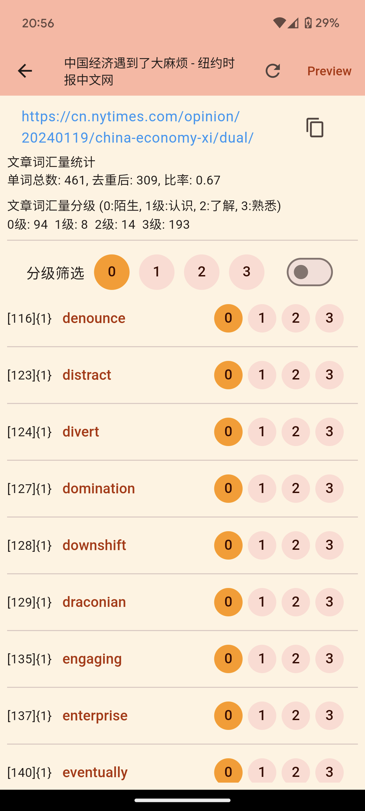
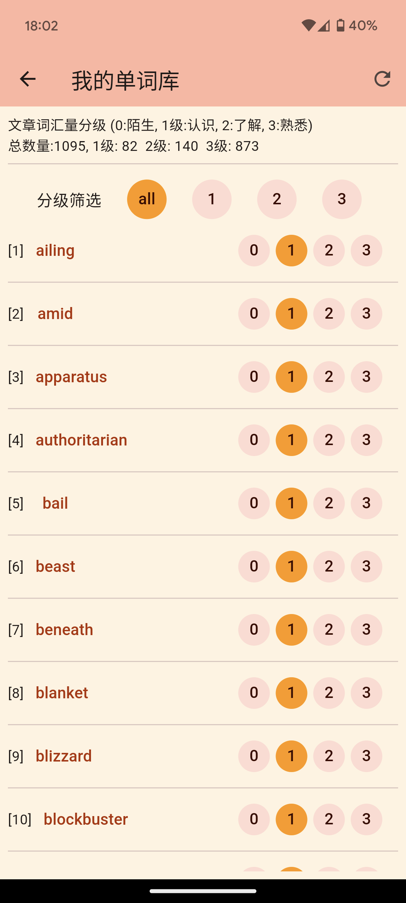

# mywords
1. 本项目是一个英语单词学习工具，旨在帮助英语学习者通过阅读英文文章来增加词汇量。
2. 你可以输入一个英语或双语文章的网址，本工具将自动提取文章中所有单词及其所在句子，并计算词汇总数，并帮助你记录每个单词的认知程度。它还能去除重复的单词，并允许你排除那些你已经知道的单词。
3. 为单词打上标签，分为“0:陌生”，“1:了解”，“2:认识”，“3:熟悉”，以帮助跟踪学习进度。一旦标记完成，单词将自动被加入你的词库中。
4. 对已解析的文章单词进行筛选，根据标记等级进行。例如，选择“0”将显示所有“陌生”的单词。
5. 该工具支持安卓(Android)、Linux和Windows平台上的使用。不同设备之间的数据可以进行相互同步。
## 学习建议
- 阅读英文文章是提高词汇量的有效方法之一。数据显示，通常每篇英文文章的有效词汇率在50%~70%之间(其中的标点符号、冠词、介词等较为简单的词汇已自动去除，如a,in,on,the,I,than,you,he等)，建议坚持每天阅读英文文章，并记录新学到的单词。
- 随着阅读量增加，你的词汇量会逐渐提高，你会发现你每阅读一篇新文章时的“0级陌生单词”会越来越少。
- 推荐使用以下英语学习资源：[The New York Times 中英文版](https://cn.nytimes.com/zh-hant/)，以获取优质的英文阅读材料。 


## Getting Started
- 请根据你要使用的平台选择对应的编译指令进行编译：
  - 安卓: `make build-android`
  - Linux: `make build-linux`
  - Windows: `make build-windows`
- 编译完成后，安装包将出现在"bin"文件夹中。

## 项目结构
```
├── bin                   # 编译后的项目文件目录，安卓为.apk，Linux为.deb，Windows为.zip
├── mywords-go            # 用于编译SO库的go核心逻辑源代码目录
├── mywords-flutter       # Flutter源代码目录，用于编译安装包
├── makefile              # 项目的Makefile文件
├── readme.md             # 项目的说明文档

```

## 依赖
- Windows 环境下，需要对CGO进行支持
- 如果没有安装对应的 CGO 运行时环境、则在运行的时候会引发如下错误。
  > exec: “gcc”: executable file not found in %PATH%
  - Windows GO 语言 CGO 运行时环境配置
      - https://www.expoli.tech/articles/2022/10/18/1666087321618
        
  - Make for Windows
      - https://gnuwin32.sourceforge.net/packages/make.htm
      - Complete package, except sources
## 预览

 
 
 
 
 



## 添加词典
- 由于词典数据库文件过大，无法上传至此，下面是详细的制作步骤。
- 同时，对学习英语感兴趣的朋友，如果不清楚的地方也可以添加我的WeChat(vitogo-chat)进行沟通。

- 词典库源文件应当是一个zip压缩文件，压缩文件包含:


```text
├── data
├── html
├── *.css
├── *.js
└── word_html_map.json

// data: 文件夹，用于存放字典资源文件，包含图片、声音等
// html: 文件夹，用于存放单词释义页面的html文件
// *.js,*.css: 文件，html文件夹下的html文件需要引用的资源，文件名应当包含.html后缀
// word_html_map.json: 文件，用于存放单词和html文件名的映射关系，是一个map,key是单词，value是html文件名(不包含.html后缀)，例如：
  {
  "applauses": "179677",
  "applausive": "179678",
  "applausively": "179679",
  "apple": "769680"
  ...
  }
```

以上zip文件的制作, 可以下载 mdx/mdd格式词典文件，如[mdict词典包/牛津高阶英汉双解词典（第10版）V3](http://louischeung.top:225/mdict%E8%AF%8D%E5%85%B8%E5%8C%85/%E7%89%9B%E6%B4%A5%E9%AB%98%E9%98%B6%E8%8B%B1%E6%B1%89%E5%8F%8C%E8%A7%A3%E8%AF%8D%E5%85%B8%EF%BC%88%E7%AC%AC10%E7%89%88%EF%BC%89V3/), 
然后进行提取制作。解析、提取mdx/mdd词典资源请参考下载python代码: [https://bitbucket.org/xwang/mdict-analysis/src/master/](https://bitbucket.org/xwang/mdict-analysis/src/master/)

1. 提取制作html文件及`word_html_map.jso`:

```pythnon
# coding: utf-8
import hashlib
import json
import os
from readmdict import MDX, MDD
def str_encrypt(bytes):
    """
    使用sha1加密算法，返回str加密后的字符串
     # string.encode('utf-8')
    """
    sha1 = hashlib.sha1()
    sha1.update(bytes)
    return sha1.hexdigest()
 
def makeHtml():
    mdx = MDX('<.mdx文件路径>')
    os.makedirs("html",exist_ok=True)
    i=0
    wordsHtmlSha1Map={}
    items=mdx.items()
    for key,value in items:
        i+=1
        word=key.decode(encoding='utf-8')
        sa1Str=str_encrypt(value)
        dir=sa1Str[:2]
        fName=dir+str(i)
        wordsHtmlSha1Map[word]=fName
        df = open("html/"+fName+".html", 'wb')
        df.write(value)
        df.close()
    b = json.dumps(wordsHtmlSha1Map,sort_keys=True,separators=None,indent="  ",ensure_ascii=False,)
    f2 = open('word_html_map.json', 'w')
    f2.write(b)
    f2.close()
    print(i,"exit with 0")

if __name__ == '__main__':
    makeHtml()
  

```
2. 提取图片、声音资源文件(data 文件夹):
  ```shell
     python readmdict.py -x <.mdd文件>
  ```
3. 制作zip词典数据库压缩文件:
  ```shell
     zip -q -r -9 mydict.zip data/ html/ *.css *.js word_html_map.json
  ```
4. 将以上词典数据库文件添加设置为词典数据库文件
- > 加载本地词典数据库文件--开始解析 
- > 

## TODO
- 暗黑主题色