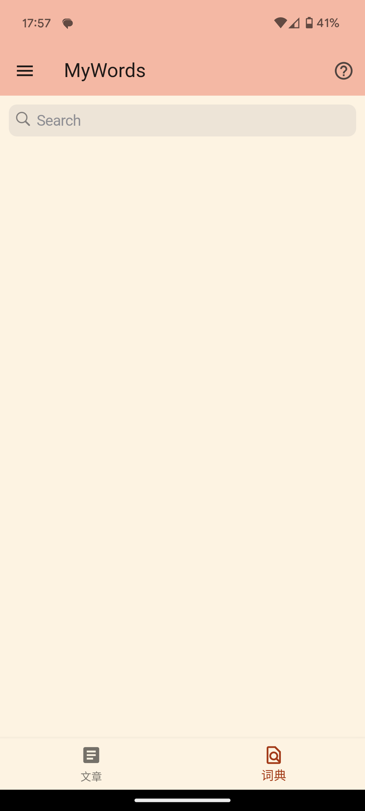
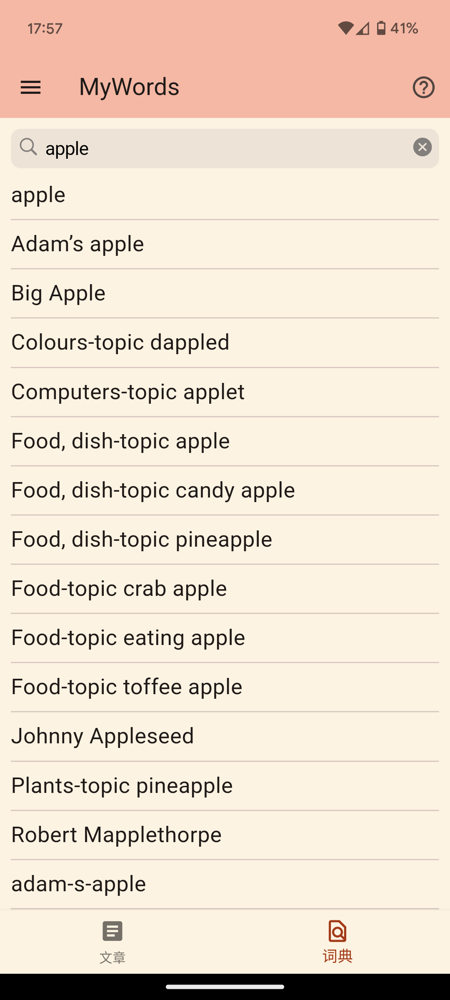
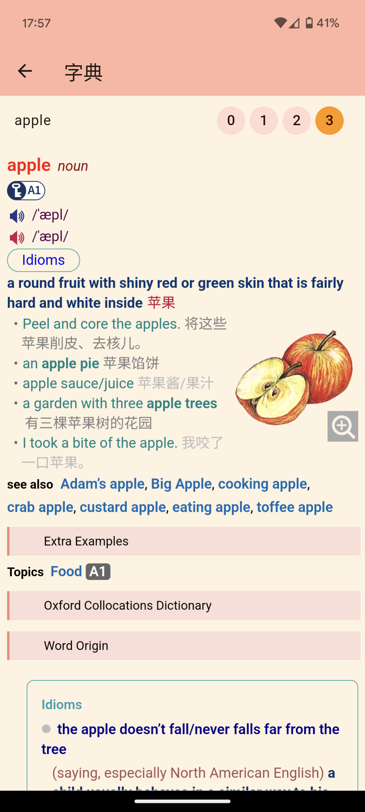
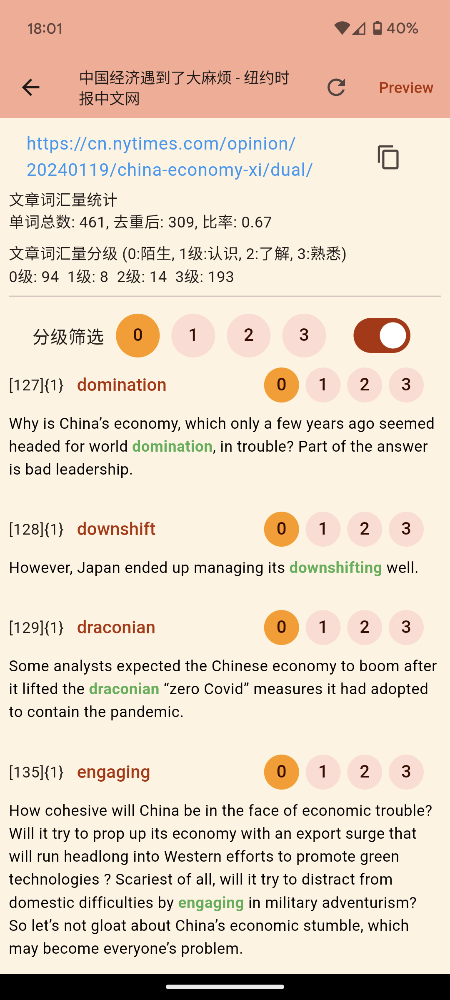
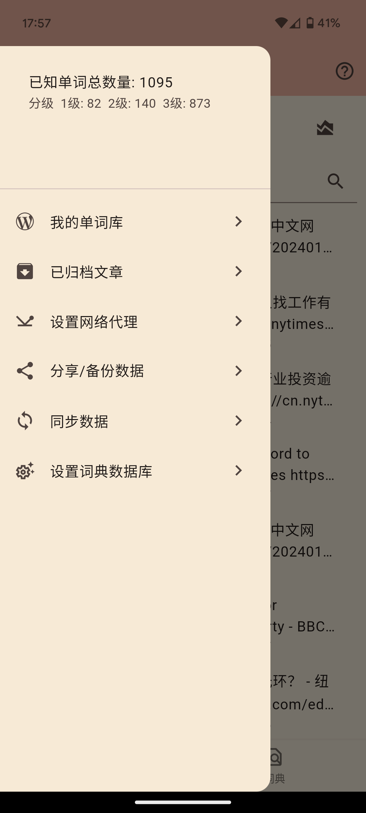
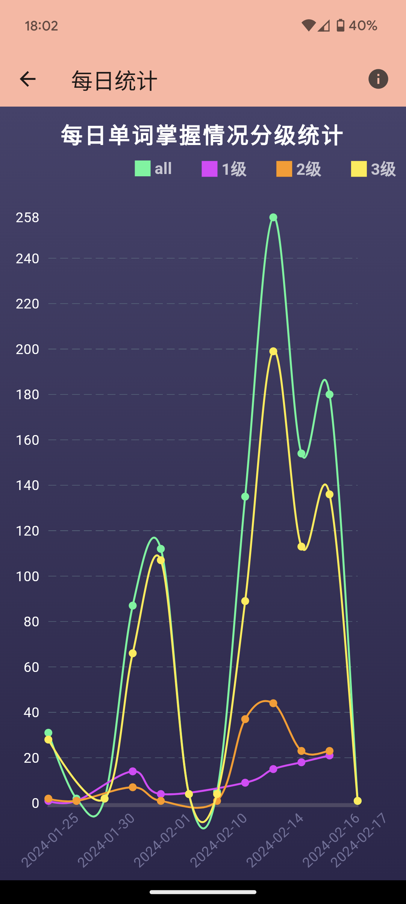
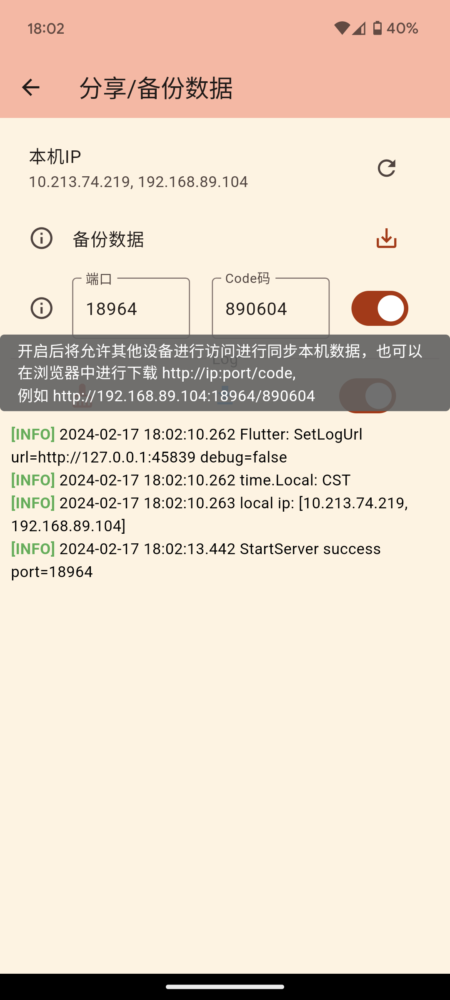
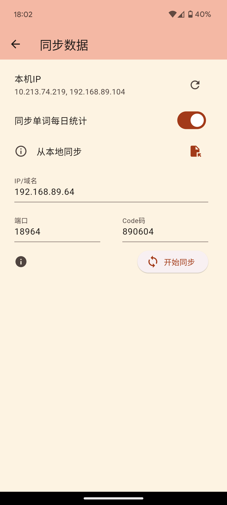

# mywords
1. 输入一个英语或双语文章的网址，本工具将自动提取文章中所有单词及其所在句子，并计算词汇总数。它还能去除重复的单词，并允许你排除那些你已经认识的单词。
2. 为单词打上标签，分为“0:陌生”，“1:了解”，“2:认识”，“3:熟悉”，以帮助跟踪学习进度。一旦标记完成，单词将自动被加入你的词库中。
3. 对已解析的文章单词进行筛选，根据标记等级进行。例如，选择“0”将显示所有“陌生”的单词。
4. 本工具支持安卓(Android)、Linux和Windows平台上的使用。
5. 推荐使用以下英语学习资源：[The New York Times 中英文版](https://cn.nytimes.com/zh-hant/)，以获取优质的英文阅读材料。
## Getting Started
```shell
make build-android
make build-linux
make build-windows
```
the binary file will be generated in the `bin` directory. linux, windows and android are supported.


## Project Tree
```
├── bin
├── mywords-go
├── mywords-flutter
├── makefile
└── readme.md
```
- bin: the compiled result of the project. .apk for android,.deb for linux, and -windows.zip for windows.
- mywords-flutter: the `flutter` source code of the file share server.
- mywords-go: the `go` source code of the file share server.
- makefile: the makefile of the project.
- readme.md: the readme file of the project.

## Dependencies
- windows环境下，需要对CGO进行支持
- 如果没有安装对应的 CGO 运行时环境、则在运行的时候会引发如下错误。
  > exec: “gcc”: executable file not found in %PATH%
  - Windows GO 语言 CGO 运行时环境配置
      - https://www.expoli.tech/articles/2022/10/18/1666087321618
        
  - Make for Windows
      - https://gnuwin32.sourceforge.net/packages/make.htm
      - Complete package, except sources
## Preview

 
 
 
 
 


## TODO
- 暗黑主题色