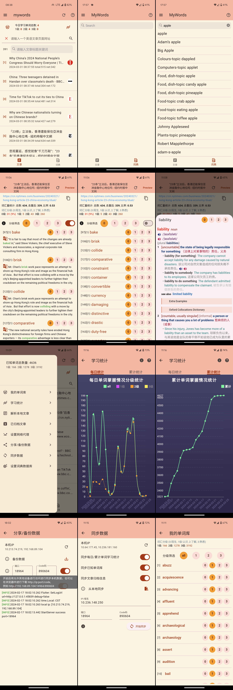
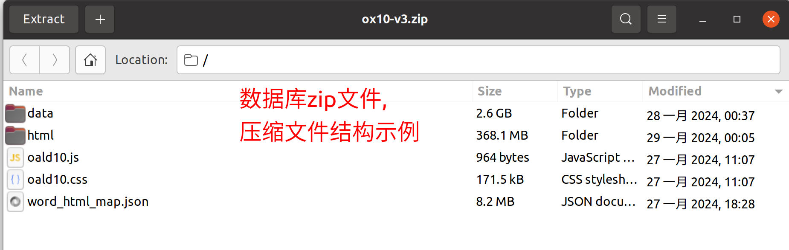

## 项目概览

本项目提供一个英语单词学习工具，专为英语学习者设计，通过阅读英文或双语文章来扩充词汇库。用户能够自动提取学习文章中的单词、统计词频、筛选过滤，同时跟踪和记录单词掌握程度。
- 背单词神器! 输入一个英语或双语文章的网址，本工具将自动提取文章中所有单词及其所在句子，对文章单词进行去重、统计汇总。你可以过滤筛选只显示出你不认识的单词。
- 本工具支持自定义词典库，用户可以添加自己的词典库，以便在学习过程中查阅单词释义。

## 日志更新

- 20040324: **重要**: v2.0.0 增加web版本，支持本地部署或云端部署。

## 功能特点

- **单词提取与记录**：输入一个网址，工具自动检索网页文章并提取里面的**所有单词**和它们的语境**句子**。同时，会计算并展示文章的**词汇量**。
- **智能管理与筛选**：避免重复学习您已知晓的单词，通过去重功能和排除掉您已掌握词汇选项以集中精力学习新词汇。
- **学习进度跟踪**：单词可标记为不同认知等级，包括“0:陌生”，“1:了解”，“2:认识”，“3:熟悉”。这有助于定制化学习路径，同时加深记忆。
- **筛选浏览功能**：过滤出特定认知等级的单词，例如选定标记“0”能显示所有您尚不了解的单词。
- **同步和平台兼容性**： 基于`Go`和`Flutter`开发的跨平台应用，支持在 Android、Linux 和 Windows 使用，支持设备间数据同步，便捷学习不受限制。
- **web版本支持**：支持本地部署或云端部署，可以在浏览器打开web应用，使用体验与桌面应用和移动应用一致。
- **本地数据存储**：无需依赖后台服务器，确保所有数据均在本地安全存储，支持本地备份、本地恢复。

## 开发与技术支持
该工具的开发考虑到跨平台兼容性和用户方便性，不仅采用了性能优良的`go`语言实核心逻辑，同时以flutter保证了良好的用户界面体验和跨平台的一致性。用户无论在何种设备上学习，都能确保学习进展无缝同步。

立足于学习英语的需求，我们的目标是创建一个简洁、高效且用户友好的单词学习辅助工具。欢迎使用本工具加速您的语言学习旅程。

## 阅读与词汇量提升
阅读英文文章被广泛认为是提高词汇量的有效手段。根据数据分析，每篇英文文章中约有50%至70%的有效词汇。请注意，已经自动剔除了文章中的标点符号、冠词、介词等简单词汇（例如a, in, on, the, I, than, you, he等）。我们建议你应该：

- **坚持每天阅读**：形成每日阅读英文文章的习惯，无论是新闻、专业论文或是小说。
- **记录新词汇**：遇到新单词时，利用本工具记录下来，并分类它们的认知程度。

## 进步的衡量
持续的阅读实践将直接反映在你词汇量的增长上。随着时间的积累，你会发现：

- **“0级陌生单词”减少**：读每一篇新文章时，遇到完全不认识的单词数量会逐渐减少。
- **读懂文章的速度提升**：你会越来越快地读懂文章，理解深度和速度都会有显著提升。

坚持在阅读中实践并使用工具来辅助你记录和回顾这些新词汇，是促进你英语能力提高的关键。随着你词汇量的增加，不仅能更流畅地阅读，更能提升写作和对话能力。

## 学习资源推荐
为了有效使用本工具并提升你的英语水平，本项目推荐以下英文阅读资源，它们不仅提供了丰富的双语内容，还覆盖了广泛的主题，适合各水平的学习者:

- **The New York Times 中英文版**：访问[The New York Times 中英文版](https://cn.nytimes.com/zh-hant/)来获取优质的双语阅读材料，这将有助于提升你的英语理解能力和词汇量。
  
- **The Economist China 经济学人-中国**: [The Economist China](https://www.economist.com/topics/china): 贴近中国读者的英语内容，覆盖政治、经济、科技等领域，对于希望深入了解全球话题的学习者来说非常有益。
  
利用这些资源，您不仅能够有针对性地扩充您的词汇，也可以深入了解不同的话题和背景知识，全方位提升英语能力。

## 开始使用指南

请根据你的使用平台选择正确的编译指令进行编译操作，可以选择安卓、Linux、Windows或Web版本进行安装。

- **编译前提**：
    - 请确保你的设备上已经安装了`go`语言环境和`flutter`开发环境。
    - 请确保你的设备上已经安装了`make`、`zip`等工具。
    - Windows 环境下，需要对CGO进行支持
        - 如果没有安装对应的 CGO 运行时环境、则在运行的时候会引发如下错误。
          > exec: “gcc”: executable file not found in %PATH%
            - Windows GO 语言 CGO 运行时环境配置
                - https://www.expoli.tech/articles/2022/10/18/1666087321618
            - Make for Windows
                - https://gnuwin32.sourceforge.net/packages/make.htm
                - Complete package, except sources

### 1. 安卓、Linux、Windows版本编译指南

- **安装指南**：
    - 对于**安卓用户**：在终端执行 `make build-android`。
    - 对于**Linux用户**：在终端执行 `make build-linux`。
    - 对于**Windows用户**：在终端执行 `make build-windows`。

- **安装包位置**：
  编译完成后，相应的安装包文件将会位于项目的"bin"文件夹内。按照标准流程安装到您的设备上后即可开始使用。

### 2. web版本使用指南 (支持Linux、Windows、MacOS)

- **web版本**：

> web桌面版本是一个独立的web应用，可以在浏览器中运行，无需安装，只需在命令行中执行二进制文件，即可在浏览器中打开web应用。
>
> 支持在Linux、Windows、MacOS等平台上使用。您可以将web版本部署到您的本地计算机设备中使用，或者部署在云服务器上以便在任何设备上使用。

- 在终端执行 `make build-web-platform`。
- 在命令行中执行编译后的二进制文件，例如
    - 在Linux下执行`./bin/mywords-web-linux`
    - 在Windows下执行`./bin/mywords-web-windows.exe`
    - 在MacOS下执行`./bin/mywords-web-macos`
- 执行后会在自动打开浏览器，访问`http://127.0.0.1:18960`或者您指定的其他端口号。


## 项目结构

```
├── bin                   # 编译后的项目文件目录，安卓为.apk，Linux为.deb，Windows为.zip，Web版本为二进制文件，例如mywords-web-linux, mywords-web-windows.exe, mywords-web-macos
├── mywords-go            # 用于编译.so库的go核心逻辑源代码目录
├── mywords-flutter       # Flutter源代码目录，用于编译安装包
├── makefile              # 项目的Makefile文件
├── readme.md             # 项目的说明文档

```

## 预览


## 添加词典指南

为了充分利用本工具的单词学习和查阅功能，您可能需要添加具有详细单词释义的词典库。由于词典数据库文件可能会很大，请按照以下步骤添加：

1. **下载词典数据库**：
  - 访问提供的非永久下载链接 `http://vitogo.tpddns.cn:9081/_download/dict-ox10-v3.zip` ，请复制该链接到浏览器中下载词典数据文件。

2. **联系和支持**：
- 如果您在使用本工具或添加词典时遇到了问题，或者想要与我们分享您的学习经验和进度，请通过以下方式联系我们：
    - WeChat：`vitogo-chat`
    - Email：`liushihao888@gmail.com`
- 您还可以加入我们的微信学习分享交流群，与其他学员一起分享英语学习心得，共同学习进步。扫描下面的二维码即可加入微信群：
    - 

3. **词典库格式说明**：
  - 词典库应当是一个zip压缩文件，该文件包含以下内容：

    

  - 结构说明：
    - `data/`: 文件夹，存放字典资源文件，如图片、声音等。
    - `html/`: 文件夹，存放单词释义的html文件。
    - `*.css`, `*.js`: 文件，html文件夹下的html文件需要引用的资源，文件名应包含.html后缀。
    - `word_html_map.json`: json文件，存放单词和html文件名的映射关系，格式为键值对json（key为单词，value为html文件名，不含.html后缀）。

4. **自制词典数据**：
  - 您可以下载mdx/mdd格式的词典文件，例如[牛津高阶英汉双解词典（第10版）V3](http://louischeung.top:225/mdict%E8%AF%8D%E5%85%B8%E5%8C%85/%E7%89%9B%E6%B4%A5%E9%AB%98%E9%98%B6%E8%8B%B1%E6%B1%89%E5%8F%8C%E8%A7%A3%E8%AF%8D%E5%85%B8%EF%BC%88%E7%AC%AC10%E7%89%88%EF%BC%89V3/)
  - 获取并使用相关的Python代码进行mdx/mdd资源的提取和转换：
    - 资源转换代码链接：[https://bitbucket.org/xwang/mdict-analysis/src/master/](https://bitbucket.org/xwang/mdict-analysis/src/master/)

## 制作词典数据库文件

在下载mdx/mdd格式词典文件以及提取词典资源代码文件后，您需要按照以下步骤制作词典数据库文件：
1. **提取制作html文件及`word_html_map.json`**:
    ```python
    # coding: utf-8
    import hashlib
    import json
    import os
    from readmdict import MDX, MDD
    from urllib.parse import quote
    import os
    import sys
    # from urllib.parse import unquote
    
     
    def makeHtml(mdxPath):
        mdx = MDX(mdxPath)
        base_dir=os.path.dirname(mdxPath)
        all_words_path=os.path.join(base_dir,"word_html_map.json")
        html_dir=os.path.join(base_dir,"html")
        print("html directory is: "+html_dir)
        print("all words json file path: "+all_words_path)
        os.makedirs(html_dir,exist_ok=True)
        i=0
        allWordsMap={}
        items=mdx.items()
        for key,value in items:
            i+=1
            word=key.decode(encoding='utf-8')
            word_quote=quote(word,safe='')
            allWordsMap[word]=word_quote
            html_path=os.path.join(html_dir,word_quote+".html")
            df = open(html_path, 'wb')
            df.write(value)
            df.close()
        b = json.dumps(allWordsMap,sort_keys=True,separators=None,indent="  ",ensure_ascii=False,)
        f2 = open(all_words_path, 'w')
        f2.write(b)
        f2.close()
        print(i,"exit with 0")
    
    if __name__ == '__main__':
        # python extract_html.py <mdx_path>
        # mdx_path=sys.argv[1]
        mdx_path="<mdx_path>"
    
    ```
- 2. **提取图片、声音资源文件(data 文件夹)**:
  ```shell
     python readmdict.py -x <.mdd文件>
  ```
- 3. **制作zip词典数据库压缩文件**:
  ```shell
     zip -q -r -9 mydict.zip data/ html/ *.css *.js word_html_map.json
  ```
  - 如果压缩文件中包含其他文件，如.ini文件等，可以在zip命令中添加相应的文件名。
- 4. **将以上词典数据库文件添加设置为词典数据库文件**
  - > 加载本地词典数据库文件--开始解析 
  - > 

请按照上述步骤确保词典数据正确添加至您的学习工具中，以便在学习过程中查阅单词和词组的详细释义，从而更有效地提升您的语言能力。

## TODO
- 暗黑主题色
- IOS、MacOS平台支持
- web版本支持(已完成)，支持本地部署及云端部署

---

## 鸣谢

我们衷心感谢以下个人和组织对本项目的支持和贡献：

- 感谢 [The New York Times 中英文版](https://cn.nytimes.com/zh-hant/)为我们提供了优质的双语阅读材料，这对于英语学习者们非常有帮助。
- 感谢 [The Economist China](https://www.economist.com/topics/china) 为我们提供的高质量英文阅读材料，为我们的学习提供了丰富的内容。
- 我们对 [Bitbucket.org/xwang](https://bitbucket.org/xwang/mdict-analysis/src/master/)提供的 Python 词典解析工具表示特别鸣谢，这对我们构建词汇数据库至关重要。
- 特别感谢[louischeung.top](http://louischeung.top:225/mdict%E8%AF%8D%E5%85%B8%E5%8C%85/) 提供的牛津高阶英汉双解词典，这资源对于英语学习者们非常有价值。
- 我们对所有通过 WeChat或Email主动提供反馈和建议的用户表示深深的谢意。
- 感谢所有贡献者、测试者和使用我们工具的用户，是你们的支持让这个项目不断进步。

此外，我们还要感谢所有在幕后默默支持这个项目的朋友们。你们的鼓励和意见是项目不断发展的源泉。

